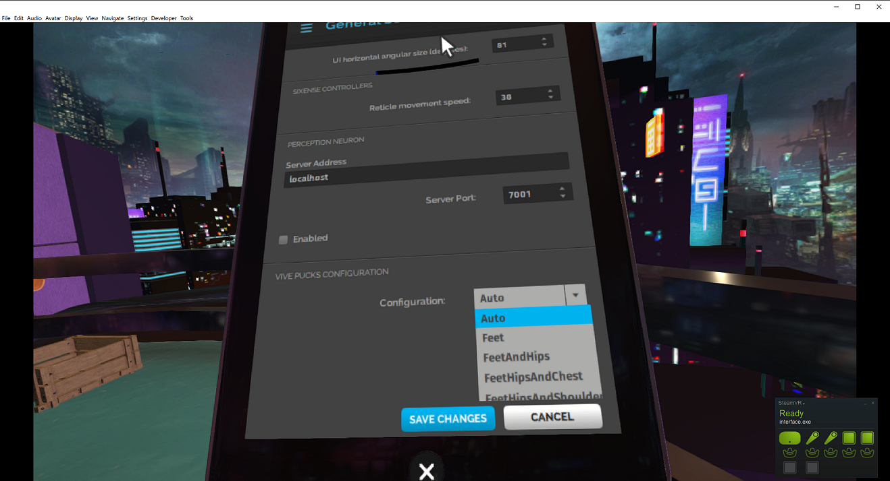

*Learn how you can set-up motion capture (mocap) in High Fidelity using Vive trackers.*

## Overview

This page guides you through the process of configuring and calibrating Vive trackers for motion capture (mocap) in High Fidelity.

## Introduction

You will need to purchase [Vive trackers](https://www.vive.com/us/vive-tracker/) to set-up a mocap system for yourself in High Fidelity. Depending on what kind of motion capture you’re looking for, the number of trackers needed differ.

- Only feet: 2 Vive trackers.
- Feet and hips: 3 Vive trackers.
- Feet, hips and chest: 4 Vive trackers.
- Feet, hips and shoulders: 5 Vive trackers.

### Configure Your Mocap System

Once you’ve purchased the number of trackers for your requirements, in High Fidelity,

- Go to **Settings > General > Vive Pucks Configuration** (this menu is only available to Vive users).
- Set your tracker configuration to one of the following options:
  - Auto: This will detect the number of trackers you’re using and calibrate to the corresponding configuration.
  - Feet
  - FeetAndHips
  - FeetHipsAndChest
  - FeetHipsAndShoulders

You have completed configuring your trackers. Now, you have to calibrate them.

### Calibrate Your Mocap System

To calibrate your trackers, stand in a T-pose (feet together, arms out) and press the following buttons on your controllers together for 1 second.

- Left trigger
- Right trigger
- Left menu button
- Right menu button

Check if you’ve calibrated your trackers by moving the corresponding joint and determine if your Avatar moves the same joint. Check to see that each tracker now tracks its corresponding joint on the Avatar.

You can press the same buttons together for a second to remove your calibration from the trackers.

> > > > > This motion capture project is still under development. We’re working to make improvements to the performance and user interface. We’ll keep you posted on our progress! You can also track the project on [github](https://www.vive.com/us/vive-tracker/).

