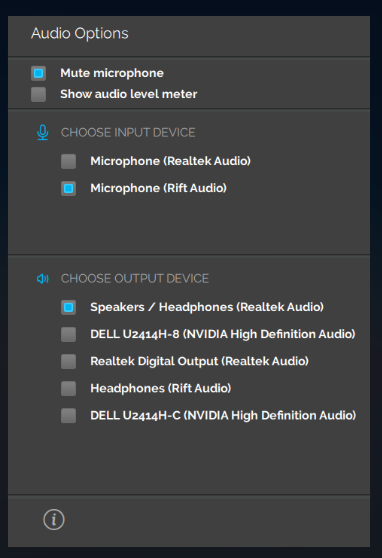
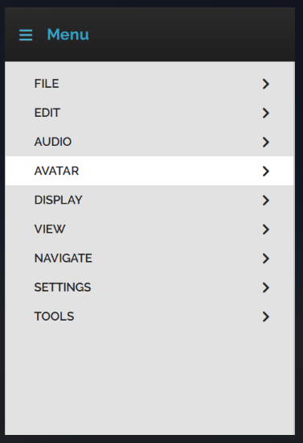
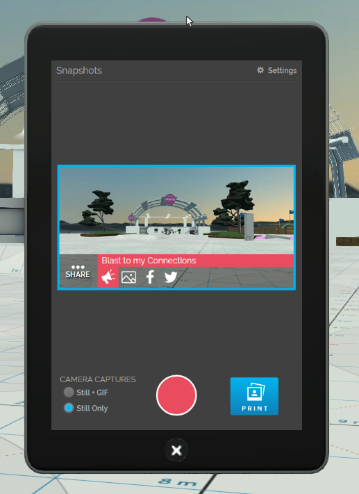
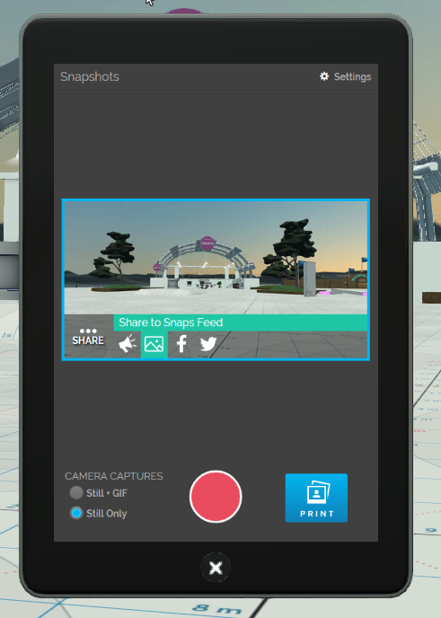
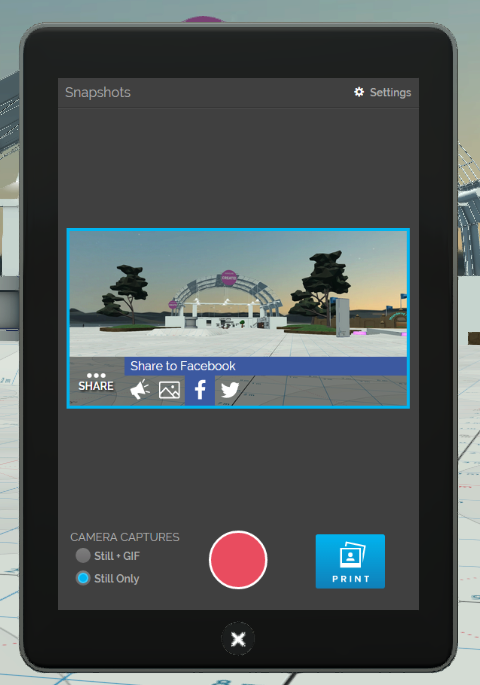
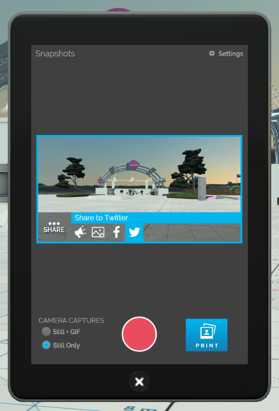
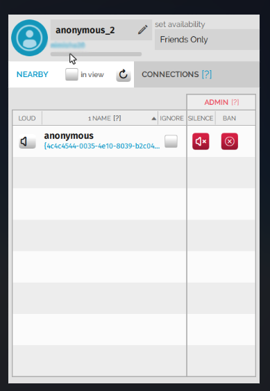
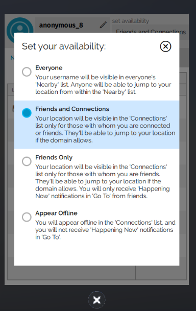
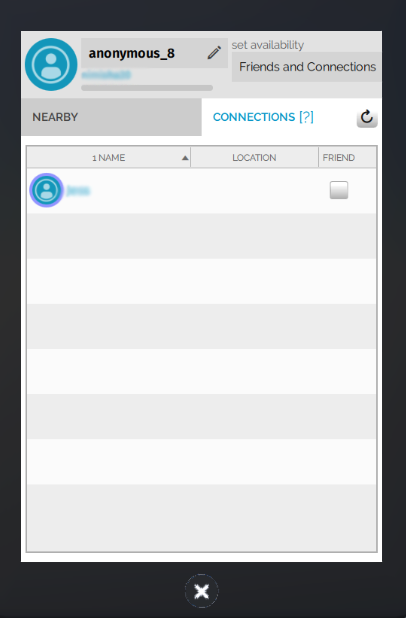
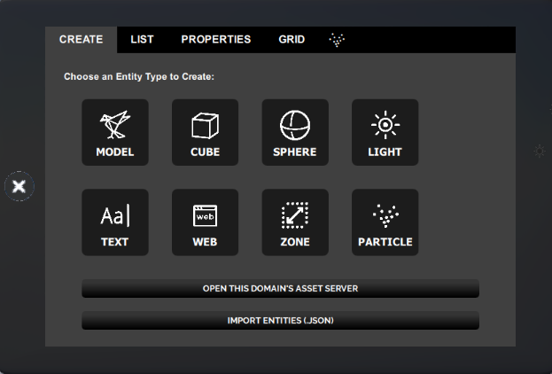

*Learn about the different menu options available on your tablet or HUD.*

## Overview

The Tablet or HUD menu will help you create and explore in High Fidelity. This page will walk you through the different options available to you. You can also log in to your High Fidelity account through your tablet. 

## Introduction

You can use the menu items in High Fidelity to load an avatar you created, to get a virtual pet from the Marketplace, and travel to different domains to meet your friends. 

###Audio

This menu item helps you control the audio output and input while you are in High Fidelity. You can select the device of your choice and also mute your audio. 

###VR/Desktop

Selecting VR/Desktop will make you switch between your HMD and desktop. If you wish to experience High Fidelity in desktop mode, you can click the VR button, and if you're in Desktop mode, you click the Desktop button to switch. 

###Menu

This is the main menu which contains options for File, Edit, Audio, Avatar, Display, View, Navigate, Settings and Tools. You can use this menu to increase the size of your avatar, change your general settings, enable advanced movements for your hand controllers and much more. 

###Bubble

High Fidelity respects your privacy. We've created the Bubble to ensure that no avatar can see you if they walk into your personal space while in VR. When you turn on the bubble, a bluish transparent sphere will be visible when an avatar nears your bubble.

###Snap

This particular menu item will help you take a snapshot in any domain. When you take a snapshot, you can save it on your system and share it in your feed. When you take a snapshot at a particular spot in a domain and share it, it is added to the GoTo thumbnail for that domain. Whenever someone wants to go to that domain, they arrive in the same spot as you by clicking the snapshot available in the GoTo menu. 

You can also blast your snap to your connections and share them on Facebook and Twitter. 

###Help

You can click on this app to check the controls and learn a little more about some tablet apps. If you are experiencing any technical issues or want to learn more about High Fidelity, you can check out our documentation through help. 

###People

People shows you the users who are online and available in the domain you are presently in. You can check for people who are nearby or in view. 

You can set your availability to show you as online only for friends, friends and connections, everyone, or no one.

It also has a tab called "Connections" which lists all the friends you made in High Fidelity using the handshake. 

###GoTo

GoTo helps you navigate to different domains and your home domain (or your sandbox). When you click GoTo, you can search for your domain by typing its name or you can look for places you want to visit. If you click on a snapshot of a domain, GoTo will take you the location where the snapshot was taken. 

###Market

Market directs you to the marketplace, where you can get anything from a new avatar and a chair, to building blocks and even a virtual pet. Currently, everything in the marketplace is free. You can learn how to build and submit your creations to the marketplace [here](../../marketplace). 

###Create

[Entities](../../entities) are the building blocks of High Fidelity. The [Create button](../../entities/create-mode) lets you add, modify and delete entities in your domain. 

