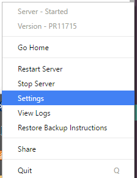
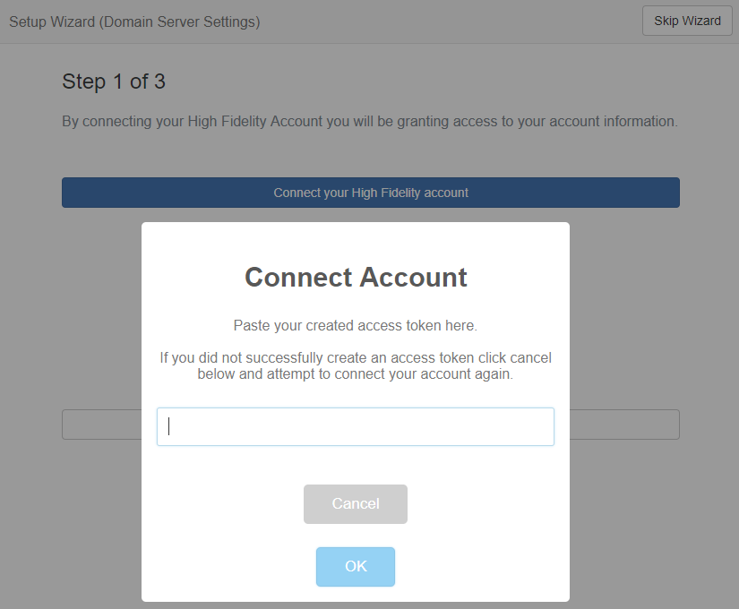
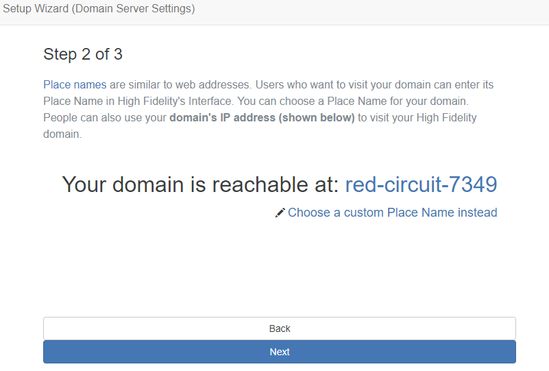
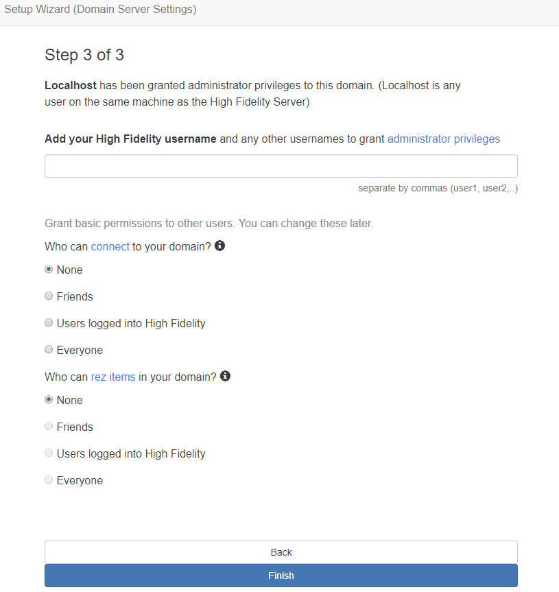
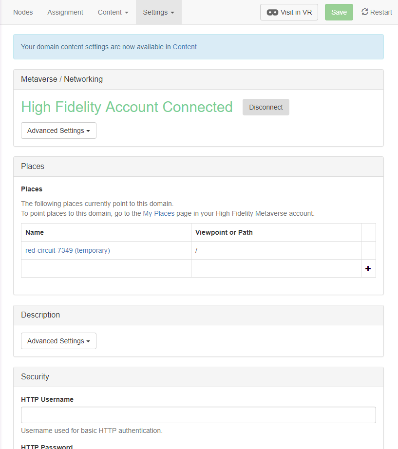

*Learn how to set up your sandbox.*

##Overview
Your Sandbox or home domain can be deployed to be accessible to anyone. The easiest way to do this is described in the sections below.

>>> If you're comfortable with GitHub, you can also set up your sandbox by compiling the domain-server and assignment-client from [source](https://github.com/highfidelity/hifi).

To get your own corner of the Metaverse up and running, follow the steps below.

##Requirements

Check the system requirements to run High Fidelity [here](https://docs.highfidelity.com/get-started/requirements).

### Download and Install the Latest High Fidelity Build

Download the latest build of the High Fidelity Client and Sandbox [here](https://highfidelity.com/download).

>>>>> We are still in the process of nailing down the minimum system requirements, but any machine made in the last 5 years with at least a dual core should be able to host a modest experience for a small number of viewers. However, for larger numbers of viewers and hosting additional content, hosting services such as Amazon S3 or Digital Ocean could be used.

To install the software, simply run the installer and follow the instructions on screen. Be sure that **High Fidelity Sandbox** is selected to be installed.

Once you install High Fidelity, you are given an option to launch Sandbox. Once launched, it should present you with a splash screen and Sandbox should now be an application in your system tray (Windows) or in the top menu bar (OS X).

*High Fidelity icon in the system tray (Windows)*

*High Fidelity icon in the top menu bar (OS X)*

>>>>>>If you did not launch Sandbox after installation, you can find the application in your **Start Menu** (Windows) or in your **Applications** folder (OS X). It's usually in a **High Fidelity** subfolder from where you can launch it.

## Steps

1. ###Visit Your Home Domain
  

  When launched, Sandbox downloads a default set of domain content (models, scripts,
  etc.) and creates a Home domain on your local machine.

  To visit your Home domain, click on the High Fidelity icon in your system tray (Windows)
  or in the top menu bar (OS X) and in the menu that opens, select **Go Home**.

  This starts the domain server and launches Interface with your avatar at the home
  domain's index position. By default, the index position is (0, 0, 0) which will put your
  avatar right in the middle of the default content.

  With the domain server running, if your network is not overly restrictive, your Home
  domain can be reached by other users; but, it won't be easy to find.

  

2. ###Configure Your Domain

  - To start configuring your domain, access your domain server settings. You can do this by going to http://localhost:40100/settings/. Or, you can right click the High Fidelity icon in the system icon tray, and then click "Settings".
  - You will be redirected to the Setup Wizard. You can also skip using the wizard if you'd like to modify the settings without using the wizard.  Connect your High Fidelity account to get started on your domain server settings. You will be redirected to High Fidelity's sign in page, where you can sign in or create your High Fidelity account. Make sure you verify your email address before proceeding. You will then be prompted to click a button to generate your access token. Copy this token to paste it in the pop-up window in the wizard. 
  - You will now see your temporary place name. You can choose a custom place name or continue using your IP address or temporary place name to give access to visitors. Click Next. 
  - In this step, you must remember to **add your High Fidelity username** to grant yourself administrator privileges. This is because admin privileges are for anyone using the local machine your domain is on. If you would like to manage your domain from other machines, you will require admin privileges. You can add other authorized usernames as well. You can also set permissions for who can visit your domain and who can rez (create) items in your domain.
    
  - You will be redirected to the main domain settings page where you can manage other aspects of your domain. 
  - You can change a number of settings from the Settings tab such Networking, Entity Server Settings, Security and more. You can modify content on your Sandbox from the Content tab. You can also visit your domain in VR using the link on the top right.  
 

3. ### Share Your Domain with Other Users

    With the domain server running, if your network is not overly restrictive, your domain 		can be reached by other users; but, it may not be easy to find. To reach your domain, 		other users will need to know your domain's [place name](../place-names) - the domain's 	unique name within High Fidelity. When Sandbox launched for the first 	time, your Home domain was assigned a randomly generated place name.

    To share this place name with other users, select **Share** from the Sandbox menu.

    

    The link displayed is the location of your Home domain.

    

    Copy this link to share it with others. They can visit your domain in Interface by selecting **Menu > Navigate > Show Address Bar**, by clicking **Go To** on the tablet, or by hitting the **Enter** key on the keyboard, and specifying the link.

    >>>>>If you have a High Fidelity account and are logged in, depending on your High 	Fidelity account settings, you may appear online in your domain to other users making you easily and immediately reachable by anyone who can see that you are online.

---
>>>If the domain is not reachable, it is possible that your network or the connecting client’s network uses symmetric NAT. In this case, for the domain to be reachable, you will need to open up the appropriate ports on your firewall to be reachable by basically all users (other than those on extremely restrictive networks that do not allow outbound traffic on unknown ports).

### Purchase and Associate a Place Name with Your Domain

You do not have the option to choose your place name and nor does it appear in the list of Places in High Fidelity. It also can't be authenticated (it can be impersonated).

But, you can assign a unique place name to your domain by purchasing one.

You can obtain a place name of your choosing (one that better represents you or your business) by [purchasing and registering a place name from High Fidelity](../place-names). Purchased place names can be authenticated.

>>> To purchase a place name, you will need to create a High Fidelity account.
