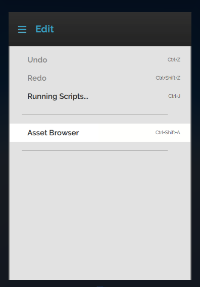
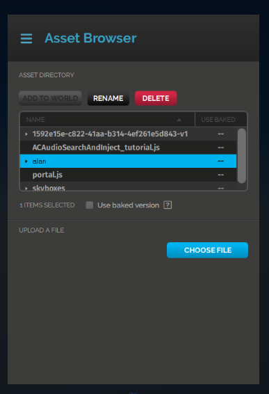
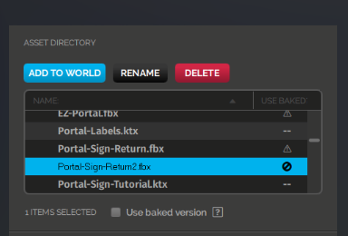

*An introduction to baking and how to bake (compress) assets using the asset browser.*

##Overview

This page discusses what baking is and how you can bake your assets using the asset browser. 

##Introduction

Whenever you upload a model or load a domain, you are rendering your assets' geometric meshes and textures. A geometric mesh (more commonly known as a polygon mesh) is a collection of vertices, edges and faces that together define the shape of a model in 3D graphics and modeling. Textures help in defining high frequency detail, color or surface textures. Loading these models in High Fidelity involves real-time rendering (drawcalls), which means images are produced and analyzed in real time. Depending on the complexity of the models, the drawcalls can differ. You can reduce the drawcalls and optimize the rendering process using baking. 

Baking optimizes the rendering process by compressing the poly meshes and textures in an asset. A baked model loads the smaller meshes first, cutting down on the load time. Baked textures are often larger than the original texture because they contain textures with different resolutions. 

In High Fidelity, baking helps in improving the efficiency with which models are stored and transmitted. Our baking process allows us to progressively stream assets to any users in a domain, allowing for faster rendering and an improved experience. 

###Baking in Your Asset Browser

* Go to **Menu > Edit > Asset Browser** to access your asset browser. 
>>>When you first launch your asset browser with the baking feature, all assets that can be baked will start baking. This might show up as heightened CPU usage. This is a one-time process.

* Add a model to your asset browser by clicking "Choose File". The uploaded model immediately begins baking. Any .fbx model will take less than a minute, while skyboxes will take longer. You will need to reload Interface to use the baked version. 
* Once your model has finished baking, a check mark will appear under the "Use Baked?" column. 
>>>>> You can only bake objects that have the extension .fbx and skyboxes, in domains where you have create access. You cannot bake .fbx objects referencing external textures. Only .fbx objects with embedded textures can be baked. 

* You can check if the assets in the domain have been baked by checking the "Use Baked?" column next to each asset in the asset browser. 
  * An asset that has already been baked will have a triangular sign under the "Use Baked?" column signifying that it has already been baked and cannot be baked again. This symbol also shows up when there have been errors while baking an asset. 
  * When you uncheck the "Use baked (optimized) version" checkbox for assets that have already been baked, they will have a stop symbol in the under "Use Baked?" column. After you uncheck the checkbox, you have to reload Interface to use the unbaked version. 
  * When an asset cannot be baked, it will have two dashes next to it under the "Use Baked?" column. 

When you first launch your asset browser with the baking feature, all assets that can be baked will be baked. This is a one-time process. Any models or skyboxes you add to your domain afterwards, will be baked on upload. 

#### Baking an Avatar

If you need an avatar to stay in your domain, you have to upload it to your Asset Server. The avatar or .fst file contains a texdir - something with which you can specify where to load textures from. 

If you try baking an .fst with a texdir, the textures for the baked avatar will fail to load. You can either:
* Not bake the avatar by unchecking the box "Use baked (optimized) version" in the Asset Browser. 
* Upload an .fst file without a texdir. 

