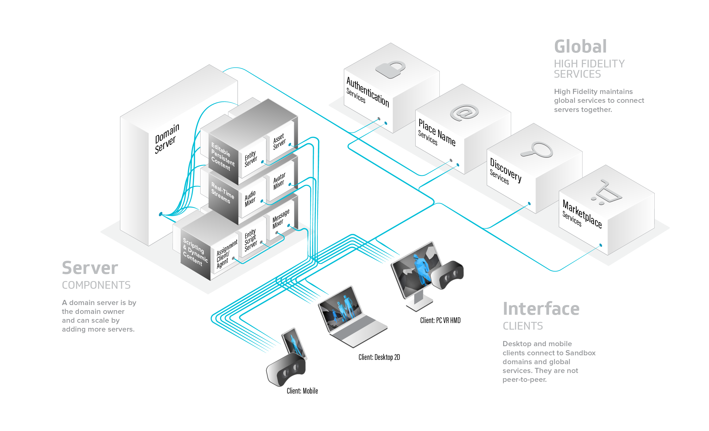
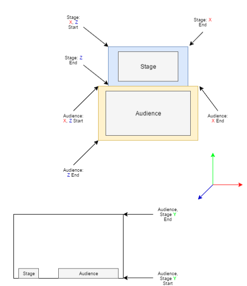

*Learn how to set up a theater domain.*

## Overview

If you’re planning to host an event in virtual reality, you’ve come to the right place! This tutorial will walk you through creating and setting up a domain with a customizable theater that meets your needs. At the end of this tutorial, you’ll be able to:

- Set up a server and connect it to a domain.
- Add a theater environment.
- Configure audio server settings for a large audience.
- Manage server access and edit privileges.

Before we dive in, let’s take a look at the customizable theaters available in High Fidelity.

## Introducing Zaru

Hosting an event in High Fidelity has never been simpler - welcome to Zaru, your personal theater for any of your virtual reality event needs. While you’re free to create your own theater or environment for hosting events, we created Zaru as an easy starting point for you to host events. Zaru has a wide variety of features geared towards hosting a great event:

- Seating for up to 100 avatars.
- Customizable environment tools.
- Audio attenuation settings that keep the audience quiet and focus on your performers at center stage.

All you’ll need to bring - is the show!

## Setup your Server

High Fidelity’s distributed platform enables almost limitless server configurations that you customize for your hosting needs. For smaller events (up to 10 avatars), a single instance of a server OS would be enough, as long as it’s a relatively recent computer. You can also set up a virtual machine hosted with cloud services providers such as Amazon, Azure, or Digital Ocean. For large-scale events, you can determine if you need more powerful hardware, or setup a distributed system with each assignment client running on a different server.

You can setup your server by either:

- **Installing Sandbox**: This will be a single application installation that contains all the required components.
- **[Compile from source](../../../build-guide)**: You can build each component individually and set-up the assignment client to point to each of the various sub-components.

### Scale for Larger Events

We have hosted events with 100+ users by using a distributed server model for assignment clients, with virtual machines running Ubuntu on Amazon Web Services. You can check out the details on the size of each machine used for our event on February 10th [here](http://blog.highfidelity.com/blog/2017/2/21/scaling-in-a-single-virtual-reality-space).

### Set Permissions

Once you have successfully setup your domain, you’ll need to configure access settings to edit the contents of your server from the Interface client. Follow the instructions in [Setup Your Domain to Build in High Fidelity](../../../learn-with-us/setup-your-domain-to-build) to configure your server settings and add users to your domain with edit privileges.

### Add the Theater

By default, a High Fidelity Sandbox will contain the tutorial environment and a builder grid. The tutorial content is centered around the location 0, 0, 0 and the builder grid is centered around 0, -200, 0.

Here's how you can delete the tutorial content:

1. Enable Edit Mode at 0, 0, 0.
2. View the entity list and select all of the objects within a 100m radius by holding down Shift and clicking the first and last entity.
3. Unlock all entities by clicking the lock icon twice. If you can’t lock or unlock entities, ensure that you are logged in and that you have granted your user account the proper permissions to lock, unlock, rez, and delete objects.
4. Once all of the entities are unlocked, delete them to get a clean space to build in.

Your avatar will be floating, but we’ll change that in just a minute.

You can import the entire Zaru theater, as well as the ground, zoning lights, and models, to your domain. Once you have a copy of the objects in your domain, you can customize them to personalize your theater.

Import Zaru to your domain:

1. Enable both the Advanced and Developer menus.
2. Copy and paste the contents of [ZaruTheater.json](https://hifi-content.s3.amazonaws.com/liv/production/ZaruTheater.json) and save it to your computer.
3. Go to Edit > Import Entities and select the JSON file that you just saved.

When you import the JSON file, you’ll get a zone for the theater, all of the necessary models for the theater itself, lights, and a builder grid base. These are all separate, so take care if you relocate objects to align everything the way you want.

The Zaru theater file contains a specific zone called SKY/Inside, which has a set of properties for the interior of the theater. You can change settings in here to specify some permissions for users, including whether or not they are given the ability to fly.

## Server Settings

### Attenuation Settings

When you host events in the theater environment, you’ll probably have performers or presenters on stage and you’ll want to update the audio in the environment accordingly. High Fidelity supports audio settings in the form of attenuation zones. These zones can be used to create different volume levels for people around your domain. For our theater, we want audio from the stage to be louder and prioritized over the audience audio, so that people in the back of the theater can hear, and so that the audience doesn’t talk over whoever is on stage.

Find the location of where your stage, audience, and microphones are in your domain. Make a note of the coordinates on the corners of each area where you want to change the attenuation settings - you’ll need to update these in the server settings of your domain.

Find your avatar’s coordinates by:

1. Opening up the console (CTRL + ALT + J).
2. Typing `JSON.stringify(MyAvatar.position)`.

or by hitting the "/" button and reaing the "position" in the middle column. 

Audio Zones are defined by a start and end coordinate value for each of the three axes in-world. An example of how you might choose to define your zones is illustrated in the diagram below. In the sample, the X and Z values are defined along their respective axes, and the Y start and end would be the value of the floor and ceiling. To add audio zones to the Microphone stands in Zaru, create a smaller region within the audience.

Our Content Team tech lead Liv has made a handy tool for audio zone bounding boxes you can find here:
https://hifi-content.s3.amazonaws.com/liv/getCoords/getCoords.js
The way to use it is to create a cube in world and size and align it to where you want the boundaries of the audio zone to be. Run the script, click on the cube. The x,y,z coordinates will appear in the scripts window. Use those to define the zones in the domain settings page.

Once you have the coordinates of your audio zones:

1. Open the server settings page for your domain.
2. Click Settings > Audio Environment.
3. Define the audio zones that you mapped out earlier. You can keep this simple, and map only the stage and audience, or assign zones for the lobby, wings, microphones, etc.
4. Set Attenuation Zone combinations based on the locations you decided on, setting sources that you’d like to be loud to everyone to 0.

If you are having trouble with your Audio Zones check for the following:
1. For the start to end positions, place them generally in lowest to highest order.  
2. Make sure the audio zones don't cross each other's paths, but try to make the differences between them small. 
3. If you aren't in an audio zone, the default attenuation will take hold that you can adjust as well.  If you want to make sure the audience can't be heard while the speaker is talking, pay attention to accidently crossing those areas. 
4. To change how people in the same zone talk to each other, use the same zone for the speaker and the listener and adjust accordingly.
5. Make sure you think about how each zone should interact with the other zones.  Stage to Audience, Stage to Mic1, Stage to Stage, Mic1 to Stage, Audience to Stage, Audience to Audience, etc...

Save your audio settings and test them until you find a combination that works for you. Other audio settings that you may want to experiment with are:

- **Noise muting threshold**: You can customize how loud someone can get before they are muted
- **Reverb settings**: For custom decay and reverberation of audio in specific zones

### Access Control

You can set custom access controls depending on the type of events you plan on hosting in your space. If the event is limited to certain people, you’ll want to create an access list in your server settings to add specific user accounts.

The People Access List (PAL) is a handy tool for moderating your event once it has begun. You can use the PAL by selecting the People tab and viewing everyone in the domain. Admins of your domain have additional silence and ban permissions to remove ill-behaving visitors. You can also manage blocked users on your server settings page.

## Configure a Place Name

To authenticate and make your domain easier for users to find, you can purchase a [place name](../place-names) that connects to your domain.

## Additional Server Settings

In addition to security and audio settings, there are several other tools you can use to plan your events. You can:

- Set avatar scaling to prevent people from making avatar sizes outside of a set range.
- Maximum user capacity and fallback location if there are a limited number of people who you want to be able to host at a time.
- Places/Paths: You can customize an exact location that you want people to spawn into your theater by specifying the location under ‘Paths’. The /path is the default, but you can customize paths (ex: /stage to spawn on stage, /audience for audience members) to move to different locations
