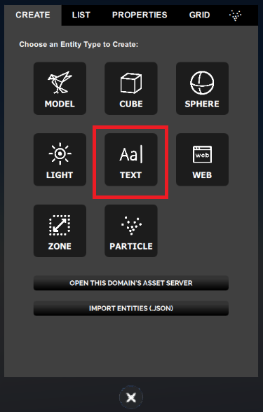
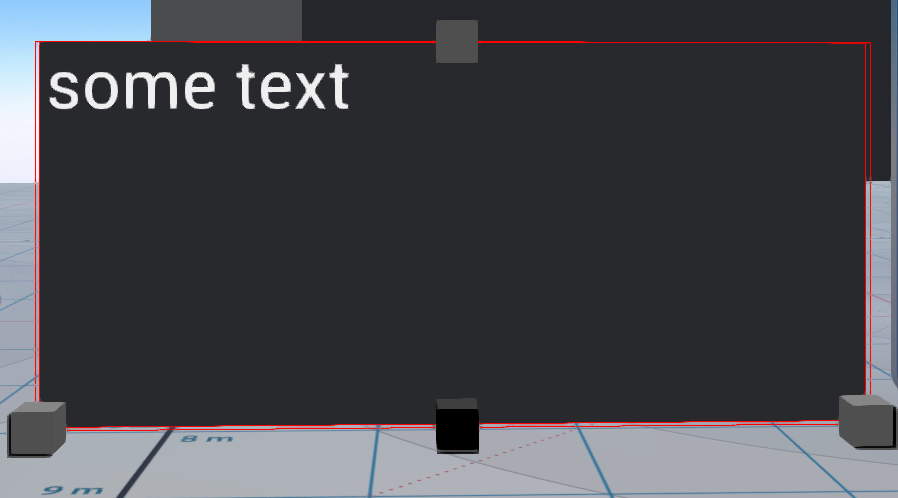
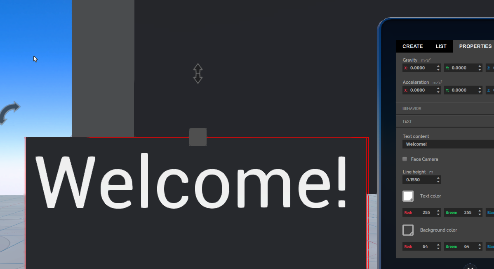
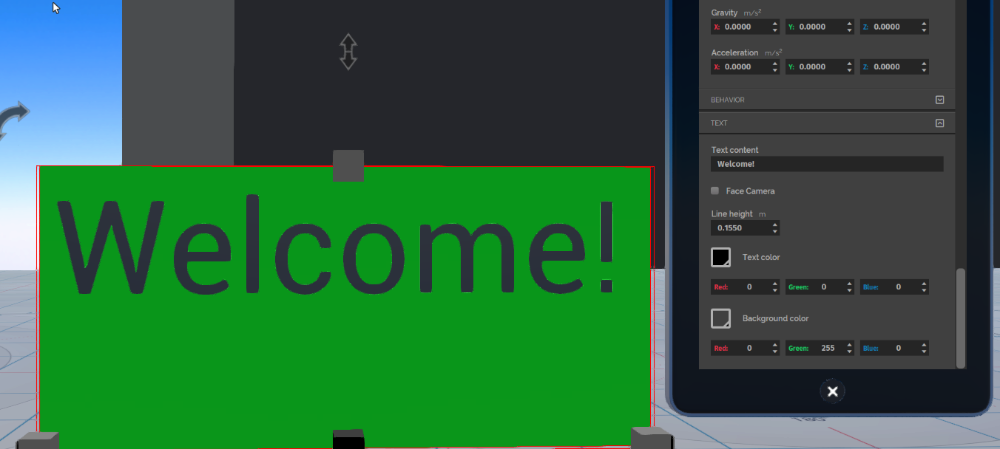

*Create and edit a text entity.*

## Overview

The Text entity is a flat panel which has the ability to display text like a whiteboard or a blackboard. Here, we talk about how you can create and edit a text entity. 

## Create a Text Entity

Go to **Create** and click on the Text icon. 

This will create a Text entity displaying the default text, "Some Text".

> > > > > If you are unable to see the text, you may need to move to a position where you can see it, or use the edit tools to rotate the plane to a position where you can see it.

## Properties

Text entities have the properties common to all entities as well as one additional text specific property.

> > > > > A text entity is a flat panel and as it has no depth, for the dimension property, the Z value is ignored.

You can view and edit these properties in [Create Mode](../create-mode) by selecting the entity and then selecting the **Properties** tab in the *Edit* panel.

## Example: Create a Green "Welcome" Sign

For example, to create a text entity that displays the word "Welcome!" in big black letters on a green plane, complete the following steps:

1. Create and position the text entity.
2. Change and resize the text displayed.
3. Change the background and text colors.

### Create and Position Text Entity

To create and position the entity:

1. Create a text entity.

2. If you are unable to see the text, use the [create tools](../create-mode) to rotate the plane to a position where you can see it.

### Change and Resize the Text Displayed

To change and resize the text displayed, you need to edit the entity properties.

1. With the text entity selected, click the **Properties** tab.
2. Scroll to the bottom of the panel where you will find the Text entity specific properties.
3. Change the text displayed to "Welcome!". For your own projects, if you plan to display a lot of text, you can first type the text into a plain text editor and then copy and paste the text into the **Text content** field. Press enter or click on another active field and the updated text should appear.
4. Change the size of the text. Below the **Text content** field is the **Line height** field. This value controls how big the font will be.

If you use the up and down carats to change the value, the value will change by 0.005 per click. If you enter a value, you will see the text change as soon as you press enter. The Line height default value is 0.06. For this example, the Line height was set to 0.1550.

If the text is too big to fit, you can increase the size of the entity.

### Change Background and Text Colors

To change the background and text colors, in the **Properties** tab:

1. Scroll down to the **Text color** and **Background color** properties.

2. Change the RGB values to the following

      Text color- Black (Red: 0, Green:0, Blue: 0) 

      Background color - Green (Red: 0, Green:255, Blue: 0).

  

If you use the carats to change the value, as you click to increase or decrease the value you should see the text or background change with each click. If you enter in the values directly, you will see the text or background change as soon as you press enter or click on another active field.

## Uses of the Text Entity

Like the other entity types, you can [attach scripts](../../all-about-scripting/attach-entity-scripts) to the entity by specifying a script or URL that can be included in the **script** field. These scripts can dynamically update the text or any other properties of the text entity.