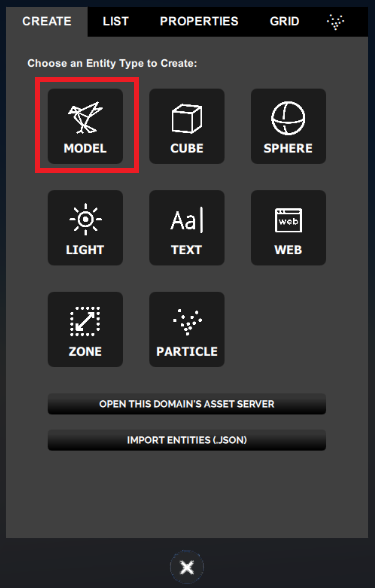
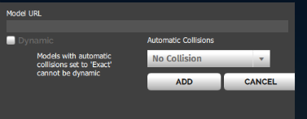

*Learn how to add a model entity.*

## Overview

Here, we'll cover how you can add a model entity. 

### Upload 3D Models to Add a Model Entity

Go to **Create** and click the model icon to upload a [3D model](../../3d-models) to create a model entity. 

Model entities allow you to add complex shapes such as trees, houses, cars, aliens, and much more. Anything you can create as an FBX or OBJ model can be added to your domain as a model entity. 

**Check the licensing terms before uploading any content** 
Before uploading 3D models, be sure to check the licensing terms to ensure that you have sufficient rights to upload the content.

To upload a model, complete the following steps:

1. First, upload the model either to your own [asset server](../../start-working-in-your-sandbox/assignment-clients), or to a hosted content server (such as Amazon S3 or a VPS server). To be accessible, all files should be in the public_html folder of the host content server. To make it easier, set up a specific folder and upload the models and all associated textures to the folder.

2. Get the full URL of the hosted model (for example,`http://mywebsite.com/myObject.fbx`) and copy it to the clipboard or a notepad.

3. Navigate to approximately where you want the model to appear.

4. Press **P** on the keyboard to enter first-person view. When added, the model will appear in front of you and first-person view will make it easiest to see.

5. Click the Model button. Clicking the Model button opens an input dialog which allows you to specify the web location where the item is hosted.

   

6. Enter the full URL of the hosted model (for example,`http://mywebsite.com/myObject.fbx`) and then click **ADD**.

The model will appear in front of your avatar.

Once placed in world, you can [create and edit the entity using your mouse or your controller](..create-mode). 
