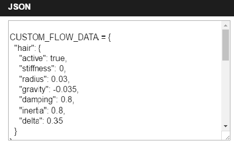

## Overview
You can simulate physics on your avatar's hair, clothes, and body parts with a little bit of scripting and the help of High Fidelity's [**Flow**](https://github.com/highfidelity/hifi-content/blob/master/Utilities/HairFlow/flow.js) script technology.

The Flow script simply mimics the natural movement of hair and other attachments on your avatar. You can manipulate and change how Flow interacts with your avatar using the [**Flow App**](https://github.com/highfidelity/hifi-content/blob/master/Utilities/HairFlow/flowApp.js). In order to use the Flow App, your avatar must contain flow threads. 
### Flow Threads
A _flow thread_ is a set of connected joints with at least one joint that complies with the following rules:
1.  The first joint is connected to an existing avatar joint (“Hips” for example).
2.  Every joint in the thread should be named ``` flow_[TYPE]_[INDEX] ```or  ``` sim[TYPE][INDEX] ```.
    * **TYPE** defines a group of joints that share a common physics setup and **INDEX** is an integer. For example, if the thread is used to simulate a skirt, all the “skirt” joints should be named flow_skirt_01, flow_skirt_02, etc.


### Flow App
After you ensure that you have the proper flow threads, run the [**Flow app**](https://github.com/highfidelity/hifi-content/blob/master/Utilities/HairFlow/flowApp.js) to enable flow for your avatar. 
>>>>> See [**this document**](https://docs.highfidelity.com/create-and-explore/all-about-scripting/run-scripts) for more information on how to run a script or app in High Fidelity.

Below are details and descriptions of the Flow app's functionality that will help you control and manipulate your avatar's flow. 

#### Display Panel
While this panel does not affect the actual behavior of your avatar's flow, it _will_ help visually debug your script. 

* **Avatar**: This setting hides or displays the avatar mesh.
* **Collisions**: This option allows you to activate or deactivate collisions.
* **Debug**: This option hides or displays the debug shapes.
* **Solid**: This setting enables either a solid or wireframe display for debug shapes.

#### Joints Panel
This panel manages all motion related to joints. 

- **Radius**: This setting determines the thickness of segments and knots (needed for collision testing).
- **Gravity**: This option sets the Y-value of the gravity vector which represents the direction of gravity as it relates the flow thread.
- **Stiffness**: This option changes how stiff each thread is.
- **Damping**: This option determines the amount of joint oscillation.
- **Inertia**: This setting changes the rotational velocity.
- **Delta**: This option controls the amount of time between each integration step. 

#### Collisions Panel
This panel manages collision spheres. Every collision sphere is positioned using an existing avatar joint and offset.
>>>>> *The maximum amount of collisions is defined by the global COLLISION_SHAPES_LIMIT = 4.*


- **Radius**: This option controls the collision sphere radius.
- **Offset**: This option changes the Y-value of the offset vector along the joint.

#### JSON Panel
This panel displays the output JSON data structure with your avatar's flow configuration, which you then include in your custom flow.js script.  

This data can be copied and pasted into the [**Flow**](https://github.com/highfidelity/hifi-content/blob/master/Utilities/HairFlow/flow.js) script between the lines:
```javascript
// CUSTOM DATA STARTS HERE
 
Erase existing code and paste new code here

// CUSTOM DATA ENDS HERE
```
You can now add the modified **Flow** script to your avatar's FST file to see your work in action. 

## How to Add an Avatar Script
In order to attach a script to your avatar, you must modify your avatar's FST file to include the path where your script lives. There are two ways to update your FST file:
1.  You can manually add a line to the FST file telling the avatar where to find the script file using `script = [FLOW SCRIPT URL HERE]`. For example: 

2. You can also use our Package Model tool to add your avatar script. 
    
    a. Create a folder in the path of your avatar that includes the script.

    b. Select the path in the "Script Directory" section of the Package Model tool, seen here: 


When packaging your model, the tool will iterate through the directory and add each script to the FST file. Now, you can upload the folder structure to the Marketplace or to your preffered hosting service.

#### Avatar Examples
Here is an example of an avatar that is rigged appropriately to use with Flow: [Mannequin with Hair](https://hifi-content.s3.amazonaws.com/jimi/avatar/Mannequin/hairTest/mannequinHairTest8.fst).


