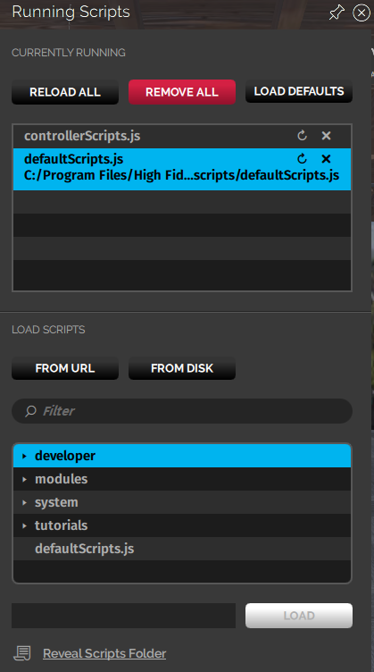

## Running Scripts

To see the list of scripts currently running, go to **Edit > Running Scripts** or press **Ctrl + J** to open the *Running Scripts* window on your tablet or HUD.

At the top of this panel, there are two buttons, **Reload All** and **Stop All**. Just below them is the list of currently running scripts. When you open Interface, it runs the default scripts designed to run at startup.

## Load and Run a Script

The *Running Scripts* window can be used to load and run scripts from a URL or from a disk drive. High Fidelity also provides a number of example scripts for you to try out. These are listed in the lower half of the *Running Scripts* window.

To run a script:

1. Go to **Edit > Running Scripts** or press **Ctrl + J** to open the *Running Scripts* panel.
2. Select the script you want to run. 
3. Click **Load** to run the script.

You should now see the script at the top of the *Running Scripts* window, as well as the results of running the script.

### Permission Required to Create/Edit Objects

Each domain owner has the ability to restrict create and edit permissions. If the script you want to run adds or edits entities and you don't have the permission to do so, you won't see any objects created or changed. However, you will still see the script listed in the *Running Scripts* window. For example, if you installed [Sandbox](https://wiki.highfidelity.com/wiki/Sandbox) and you are in your [Home](https://wiki.highfidelity.com/wiki/Home_domain) domain, if you run the High Fidelity example script `createCow.js` found in the tutorials folder, an animated cow will appear in front of you. But, if you run `createCow.js` in a domain where you don't have permissions, the animated cow will not appear.

## Reload or Stop a Running Script

You can close or restart any or all of the running scripts. To reload or stop a script, go to **Edit > Running Scripts** or press **Ctrl + J** to open the *Running Scripts* window, and then do one of the following:

- To reload all running scripts, click the **Reload All** button at the top of the *Running Scripts* window.
- To reload a specific script, click the circular arrow next to the script.
- To stop all running scripts, click the **Stop All** button at the top of the *Running Scripts* window.
- To stop a specific script, click the X next to the script.

## Get Started Writing Your Own Scripts

To get started writing your own scripts, first read [how to set up your Sandbox](https://wiki.highfidelity.com/wiki/Create_content). 

High Fidelity uses the JavaScript syntax and provides a robust [JavaScript API](../../../api-reference). If you plan to share your code with the community, we recommend following the [Coding Standards](https://wiki.highfidelity.com/wiki/Coding_Standards).

