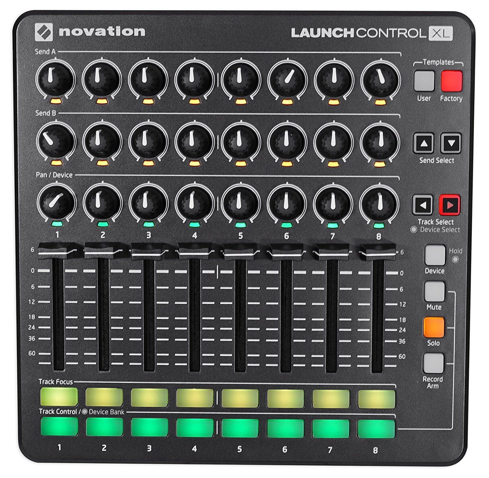
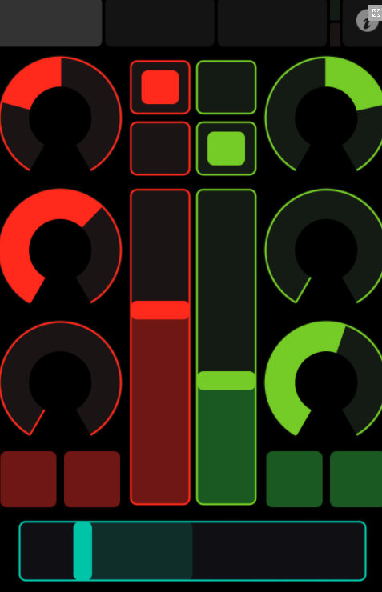

*How to use MIDI for creative control in High Fidelity*

What if there was a way to control your High Fidelity environment with real world knobs, keys, buttons, and sliders?

Our MIDI class allows for these kind of interesting interactions, both for the musically inclined, and for explorers who want to try engaging with a hybrid mix of virtual and real life controls.

A big thank you to one of our talented HiFi community members and Worklist developers, Brainstormer, for helping extend the previous work we started with MIDI.


If you have been to one of the Phlash shows on Fridays, then you have seen his awesome, funky lights being controlled live with a Novation Launch Control XL.



Sometimes this is accompanied by a second remote light designer using  in realtime!


## *So what is MIDI, and can you use it within High Fidelity?*

MIDI by itself is nothing more than a specific set of data that describes instructions for devices to talk to each other. Originally, this format was created in the 80s as a way for instruments to communicate with each other, but over the last 30 years, it has evolved into a highly organized specification that is heavily tested and adopted for a multitude of purposes.

**A little tech talk:**

The way our MIDI class is implemented, the Window’s driver passes a DWORD (32bit message), where each byte describes a different type’s value:

00000000 | 0vvvvvvv | 0nnnnnnn | 1sss | cccc
--- | --- | --- | --- | ---
|v = velocity | n = notes | s = status | c = channel

The number in the higher order bit denotes whether it is a command (1) or data (0), so that the velocity and note can represent 128 unique values (1+2+4+8+16+32+64), status with 8, and channel with 16 values. The different status types we support are:


Status | types
--- | --- |
08 | note off
09 | note on
10 | polyphonic key pressure
11 | control change
12 | program change
13 | channel pressure
14 | pitch bend
15 | system message


Every time you move a lever, rotate a knob, press/release a key, or push down a pad, you are creating a MIDI message that says what channel, what note, what velocity, and what is the status/command to run.

This is a lot of information contained in fast binary messages that millions of devices can use to communicate together. Let’s talk about how you can apply that to High Fidelity!

## Your Controller

You can either connect a real controller device, or if you don’t have an actual controller, you can create a virtual one that will help you connect to other virtual devices. For example, if you want to connect Ableton Live directly to High Fidelity’s Interface client.

We recommend the following virtual tools:

[loopMIDI](https://www.tobias-erichsen.de/software/loopmidi.html)

This will create a virtual in/out port to send information into and out of HiFi

[VMPK](http://vmpk.sourceforge.net/)

You can use this to simulate keys being pressed or sliders/knobs being manipulated if you do not have a controller.

If you have an iPad, take a look at TouchOSC to use your iPad/iPhone as a touch screen controller with buttons, knobs, and sliders.  There are some notes about using your iPhone or iPad at the end.

## Config

Now that you have a MIDI Device, the next thing you want to do is setup a configuration.

Here is a general recommended MIDI config function you can run in a script:
```
// Some helpful constants
const INPUT = false;
const OUTPUT = true;
const ENABLE = true;
const DISABLE = false;
function midiConfig(){
    Midi.thruModeEnable(DISABLE );
    Midi.broadcastEnable(DISABLE );
    Midi.typeNoteOffEnable(ENABLE );
    Midi.typeNoteOnEnable(ENABLE );
    Midi.typePolyKeyPressureEnable(DISABLE);
    Midi.typeControlChangeEnable(ENABLE);
    Midi.typeProgramChangeEnable(ENABLE);
    Midi.typeChanPressureEnable(DISABLE);
    Midi.typePitchBendEnable(ENABLE );
    Midi.typeSystemMessageEnable(DISABLE);

   // get a list of the available  in and  out device IDs
    midiInDeviceList = Midi.listDevices(INPUT);
    midiOutDeviceList = Midi.listDevices(OUTPUT);
    print(JSON.stringify(midiInDeviceList));
    print(JSON.stringify(midiOutDeviceList));
}
```


You can then see a list of MIDI devices that are currently connected.

After you run a config, next you will want to connect to midiMessages.
```
Midi.midiMessage.connect(onEventReceived);
//Your message handler will look like the following:
    /// @param {int} device: device number
    /// @param {int} channel: channel number
    /// @param {int} type: 0x8 is noteoff, 0x9 is noteon (if velocity=0, noteoff), etc
    /// @param {int} note: MIDI note number
    /// @param {int} velocity: note velocity (0 means noteoff)
function onEventReceived(eventData){
	// functions you run in response to different MIDI events
}
```

## Controlling High Fidelity

If we had a cube we would like to change the color of, we can do the following:

First, here is a really handy method to figure out the MIDI range of 0-127 to be any other output range you want using linear interpolation:
```
function lerp(InputLow, InputHigh, OutputLow, OutputHigh, Input) {
    return ((Input - InputLow) / (InputHigh - InputLow)) * (OutputHigh - OutputLow) + OutputLow;
}
lerp (0,127,0,360,eventData.velocity); // the 0 would be 0, and the 127 would be 360.
```
Since colors go from 0-255 we could do the following:
```
var red = 0;
function  changeCubeColor(redValue){
    var entityColorProps = Entities.getEntityProps(cubeID, [“color”]).color;
    entityColorProps.red = redValue;
    Entities.editEntity(cubeID, entityColorProps);
}
```

Then in our onEventReceived, our basic function would look like:
```
// eventData.device, eventData.channel, eventData.type, eventData.note, eventData.velocity

function onEventReceived(eventData){
	changeCubeColor( lerp(0,127,0,255,eventData.velocity) );
}
```

One thing you can do to see which controller is outputting what, is to print out the eventData in your onEventReceived function.

This will tell you everything you need to know about how to route the right key, slider, knob, or button to to your intended Javascript functions.

If you want to use  to control something outside of High Fidelity, or to directly call a MIDI event to control something in Hifi, you can use the function:
```
// event similar to the above
Midi.playNote(Status, Note, Velocity);
```
## Some Ideas to get you started:
- Use ableton to sequence out entire animations of your domain.
- Control real world devices by the movements things make in Hifi and vice versa(think update loop)
- Setup your iPad to be a whole group of buttons that you can press at any time to trigger events in your domain at will.

Let us know if you do something cool with it!
Right now we are only supporting Windows, but we are looking forward to extending out to Mac and Linux builds as well.  If you would like to help us do that, sign up on Worklist today!

[Worklist](https://worklist.net/)


Some examples and additional API info Brainstormer has cooked up that you can use:
- [MIDI-API](https://cdn.highfidelity.com/milad/production/Midi/MidiAPI.txt)
- [MIDI-Test](https://cdn.highfidelity.com/milad/production/Midi/midiTest.js)
- [MIDI-Examples](https://cdn.highfidelity.com/milad/production/Midi/MIDI-Example.js)


## Using your iPhone and iPad to control High Fidelity through MIDI!

If you don’t have a MIDI controller, there are some really great ways to use your iPad or iPhone to control High Fidelity:

We recommend an app called [touchosc](https://hexler.net/software/touchosc)




After you download the App, make sure to download the Windows bridge.

You can set it up either through USB or through your local wifi network in the settings menu.

If you setup your onEventReceived to log the messages coming in, you can see which knobs send what information that you can use to call custom functions with.

There are some interesting components like the accelerometer which you can use as well!

Happy MIDI'ing in Hifi!
